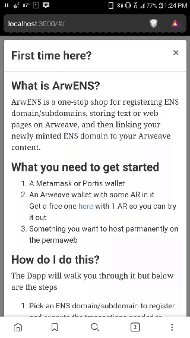
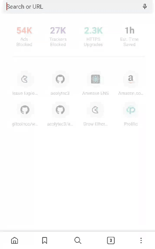

# ArwENS

ArwENS is a one-stop shop for registering ENS domain/subdomains, storing text or web pages on Arweave, 
and then linking your newly minted ENS domain to your Arweave content.

# Important Note
This Dapp only supports Ropsten ENS domains.  It's a submission for the [Grow Ethereum hackathon contest](https://gitcoin.co/issue/ArweaveTeam/Bounties/11/3273). If we win, we'll spend some real ETH and deploy on Mainnet. :)

## Features

1. Use either Metamask or Portis
2. Register ENS domains and subdomains
3. Post text and html files to the permaweb
4. Add the Arweave transaction ID associated with your permaweb file to your ENS domain
5. Supports ENS domain to Arweave file resolution (see gifs)

Registering an ENS domain

Using ENS name resolution on your Arweave content

## Getting Started

1. Clone this repository
2. yarn install
3. yarn start
4. Navigate to localhost:3000
5. Activate your preferred Ethereum wallet (Metamask/Ports)
6. Follow the prompts.
7. Once yuo've deployed a file to the permaweb, access it using your ENS domain!

## Future plans